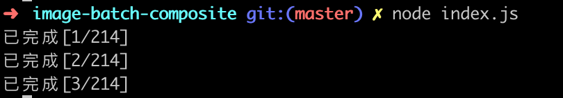

# image-batch-composite
这是一个批量合成发布会邀请函的小工具，根据给定的人名、背景图，去批量替换背景图中的人名字，最终合成邀请贴。

背景是：某天下午，运营负责人找到我，让我想办法批量生成几百个邀请函，背景都一样，只是嘉宾名字不同。

我大概在脑海里搜索了一遍可以实现这个功能的技术点，最后选择了最近较新的puppeteer来做(算是感觉一下好用程度)。

整个工程从需求提出到做出来大概半个小时把。在此记录一下，以备不时之需。

## 基本原理

- 使用 `page.setViewport` 设置puppeteer的窗口大小
- 使用 `page.goto` 加载本地的模板html
- 使用 `page.evaluate` 执行html里预定义好的js函数实现名字替换
- 使用 `page.screenshot` 将渲染好的网页截图到本地

## 使用方法

### 1.调整 `tpl/draw.html` 中的模板

- 可以替换背景图
- 可以修改文本所在的位置、字体等

### 2.调整 `tpl/fonts` 中的字体

### 3.执行工具:

``` bash 

node index.js

```

应该可以看到类似下面的提示:



然后就可以到 [生成目录](./gen/) 下去查看生成的邀请函图片了。